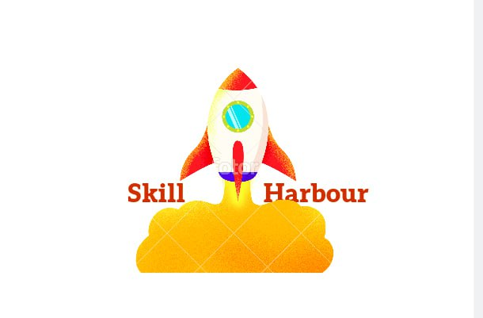
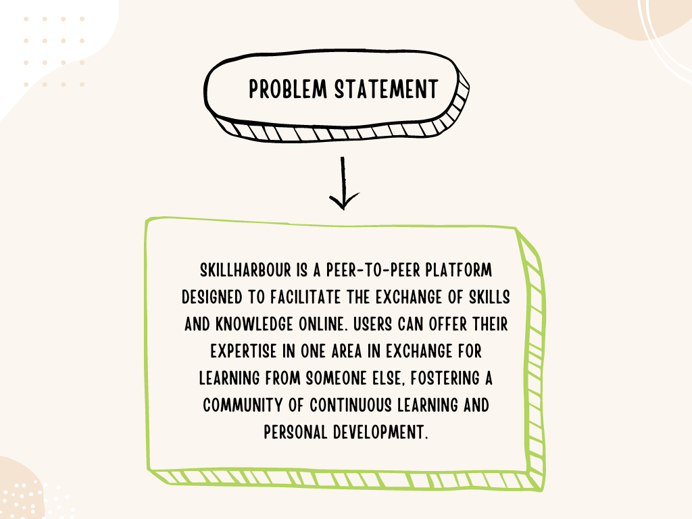

<h2 align="center">
  SkillHarbour  
  <a href="https://soumyajit.vercel.app/" target="_blank">UpSkill With Exchange</a>
</h2>

  

 

## Deployed link 
open [ https://bro-code-frontend.onrender.com]

## Built With

This project was built using these <strong>technologies.

- React.js
- Node.js
- Express.js
- MongoDB
- Tailwind Css
- VsCode
- Deployment Render.com

## Features

**📖 Multi-Page Layout**

**🎨 Styled with Tailwind Css**

**📱 Fully Responsive**

## Getting Started

Clone down this repository. You will need `node.js` and `git` installed globally on your machine.

## 🛠 Installation and Setup Instructions

1. Installation: `npm install`

2. In the project directory, you can run: `npm start`

Runs the app in the development mode.\
Open [http://localhost:3000](http://localhost:3000) to view it in the browser.
The page will reload if you make edits.

## Problem Statement

  

## WorkFlow Diagram

  

## Key Features

  

## Tech Stack

  

